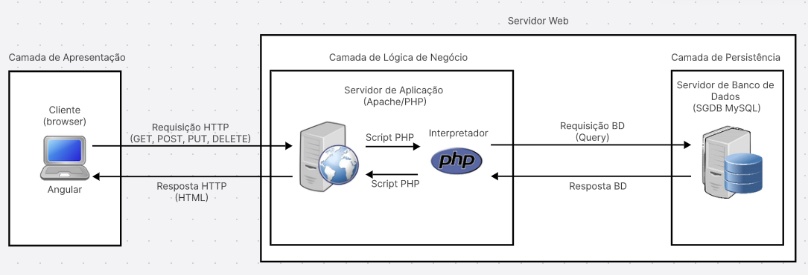

<h1 align="center"> Criando APIs com Angular </h1>

   

Curso pertencente a Trilha Java - [Programa START da Capgemini](https://startcapgemini.com.br/)

## Tecnologias Utilizadas

* **Front-end:** 
  - Angular 17.0.8 (HTML, CSS, TypeScript);
  - Node.js 21.4.0
* **Back-end:** 
  - XAMPP para Linux 8.2.4-0 (Apache, PHP, MySQL)
* **IDE:** 
  - Visual Studio Code 1.85.1

## Acesso ao Projeto

1. Clonar o repositório
```
git clone https://github.com/ana-karine/capgemini_school.git
```

2. Copiar a pasta `/php` (localizada no diretório `/capgemini_school/curso_angular/app-php`)
dentro da pasta `/htdocs` (localizada no diretório onde foi salvo o XAMPP, `/lampp/htdocs`)

3. Siga todos os passos referentes ao Banco de Dados

4. Utilizando o Visual Studio Code, abrir o projeto `app-php` (localizado no diretório `/capgemini_school/curso_angular`)

5. No Visual Studio Code, executar o projeto digitando no terminal:
```
npm start
```

6. Visualizar o projeto acessando a URL local onde a aplicação Angular está sendo executada: `http://localhost:4200`

**Banco de Dados:**

1. Iniciar o painel de controle do XAMPP

- se você usa um sistema de 32 bits:
```
sudo /opt/lampp/manager-linux.run
```
- se você usa um sistema de 64 bits:
```
sudo /opt/lampp/manager-linux-x64.run
```

- na aba `Manage Servers` clicar em `Start All` 

2. Acessar o aplicativo phpMyAdmin (para administração visual do MySQL)

```
https://localhost/phpmyadmin/
```

3. No phpMyAdmin, importar o database `api.sql` (localizado no diretório `/capgemini_school/curso_angular/app-php/database`)


## Estrutura do Servidor 

* caminho para o ponto de entrada do serviço web construído com PHP: `http://localhost/php/`;

* dentro da pasta `/php` temos os seguintes arquivos:

- `.htaccess`: remove a extensão ".php" de URLs no Apache e permite que os métodos POST, GET, OPTIONS, DELETE e PUT sejam usados em solicitações CORS;

`conexao.php`: conexão entre o código PHP e o banco de dados MySQL;

`listar.php`: script que retorna os dados da tabela "cursos" no formato JSON (caminho: `http://localhost/php/listar`);

`cadastrar.php`: script que trata a inserção de dados de um novo curso no banco de dados (caminho: `http://localhost/php/cadastrar`);

`alterar.php`: script que trata a atualização de dados de um curso específico no banco de dados (caminho: `http://localhost/php/alterar`);

`excluir.php`: script que trata da exclusão de um curso específico na tabela "cursos" do  banco de dados (caminho: `http://localhost/php/excluir`).

## Arquitetura do Projeto

